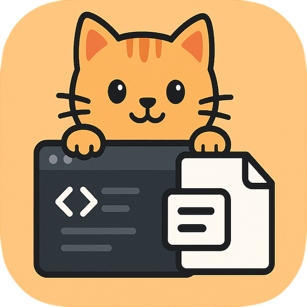

# CopyCat

**Easily bundle files for LLM context windows**

CopyCat is a VS Code extension that helps you share code with large language models (LLMs) by packaging selected files into a single, well-formatted text block. Perfect for when you need to provide context to AI assistants like ChatGPT, Claude, or GitHub Copilot.

## ✨ Features

- **Visual File Selection**: Browse and select files through an intuitive tree view in the Explorer
- **Token Estimation**: See approximate token counts for each file to manage context window limits
- **Smart Ignoring**: Automatically respects `.gitignore` rules and includes a comprehensive default ignore list for common file types that aren't useful for LLM context
- **Flexible File Tree Modes**: Choose how much file structure to include:
  - **Full Tree**: Complete project structure (default)
  - **Relevant Tree**: Only selected files and their parent directories
  - **No Tree**: Just the file contents without structure
- **Multiple Copy Modes**:
  - Copy files with basic formatting
  - Copy files with a custom prompt for better LLM context
- **Language Detection**: Automatic syntax highlighting for 20+ programming languages
- **Real-time Updates**: File tree updates automatically as you modify your codebase

## 🚀 Quick Start

1. **Install the Extension**: Search for "CopyCat" in the VS Code Extensions marketplace and install it
2. **Open Your Project**: Open a folder/workspace in VS Code
3. **Access CopyCat**: Look for the "CopyCat" section in the Explorer panel (usually on the left)
4. **Select Files**: Check the files or folders you want to include in your LLM conversation
5. **Choose File Tree Mode**: Use the tree icon in the toolbar to cycle through tree modes
6. **Copy to Clipboard**: Click the clipboard icon or use the command palette to copy your selection
7. **Paste in LLM**: Paste the formatted output into your AI assistant

## 📋 How to Use

### Basic Usage

1. In the **CopyCat** view (in the Explorer panel), you'll see your project's file structure
2. Check the boxes next to files or folders you want to include
3. The total token count is shown at the top of the view
4. Click the clipboard icon 📋 to copy all selected files to your clipboard
5. Paste the result into your LLM conversation

### File Tree Modes

CopyCat offers three different ways to include file structure:

- **🌳 Full Tree** (default): Shows the complete project structure - great for small projects or when you want full context
- **📁 Relevant Tree**: Shows only the selected files and their parent directories - perfect for large projects to reduce noise
- **📄 No Tree**: Excludes file structure entirely - ideal for quick code snippets

Toggle between modes using the tree icon in the CopyCat toolbar, or configure it in settings.

### Advanced Usage with Prompts

1. Select your files as usual
2. Click the comment icon 💬 (or use Command Palette → "CopyCat: Copy Selected Files to Clipboard with Prompt")
3. Enter a description of what you want the LLM to help you with
4. The extension will format your request along with the selected files
5. Copy and paste into your LLM

### Command Palette Commands

- `CopyCat: Copy Selected Files to Clipboard` - Basic copy with file contents
- `CopyCat: Copy Selected Files to Clipboard with Prompt` - Copy with custom prompt
- `CopyCat: Toggle File Tree Mode` - Cycle through tree modes
- `CopyCat: Set File Tree Mode` - Choose specific tree mode
- `Debug CopyCat Settings` - View current settings and statistics

## 📄 Output Format

When you copy files, they're formatted as clean markdown with:

1. **Codebase Overview** - Brief introduction for the LLM
2. **File Structure** - Project tree (based on your selected mode)
3. **Selected Files** - Full contents of your chosen files with proper syntax highlighting
4. **Prompts (optional)** - System/user prompts that get added to the context so you can simply paste and go

## ⚙️ Settings

Configure CopyCat in VS Code settings:

- **File Tree Mode**: Choose between "full", "relevant", or "none" for file structure inclusion
- **Show Ignored Nodes**: When enabled, files matching ignore patterns appear greyed out but unselectable. When disabled (default), they're completely hidden.
- **System Prompt**: Add a custom system prompt that gets prepended to every "Copy with Prompt" request.
- **Default Ignore Patterns**: Customize the list of file patterns that are automatically ignored. These patterns are applied in addition to `.gitignore` and `.contextignore` rules. The default list includes common file types that aren't useful for LLM context like images, videos, data files, build artifacts, and dependencies.

## 📁 Ignore Files

CopyCat respects multiple ignore mechanisms (in order of precedence):

1. **Default Ignore Patterns**: Built-in patterns for common file types (configurable in settings)
2. **`.gitignore`**: Will ignore files that are ignored by git
3. **`.contextignore`**: Project-specific ignore rules for LLM context (create this file in your project root)

Create a `.contextignore` file in your project root to specify additional files or patterns that should be excluded from LLM context, using the same syntax as `.gitignore`.

## 🤝 Contributing

Found a bug or have a feature request? Visit our [GitHub repository](https://github.com/lkleinbrodt/Copycat) to contribute or report issues.
